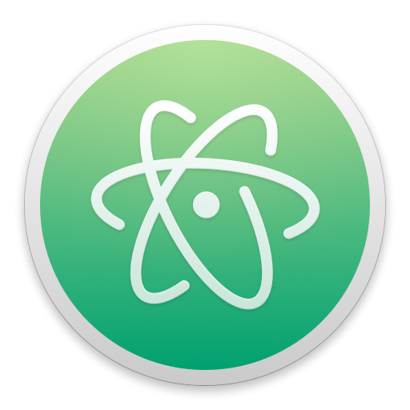

# Electron at MongoDB
## Lucas Hrabovsky
## LibertyJS, Oct. 1 2016

^ Welcome

^ Thanks for having me this morning

^ Get a few logistics out of the way first

---

<!--  -->

`#libertyjs` `#electron`

@__lucas

^ Tweet about this talk using these hashtags

^ We'll have time for Q&A at the end but feel free to @ me instead or if we run out of time

^ TODO Twitter icon

---

> disclaimer: does not reflect the views of MongoDB Inc.

---

# Agenda

- What is MongoDB Compass?
- What is Electron?
- Why go from web to desktop?
- Q&A

^ 40 min of talking
^ 15 min of Q&A at the end

---

# about:lucas

^ I'm Lucas

^ My desk is in NYC, but most of the time I'm working from home in the Fairmount neighborhood of Philadelphia.

^ Relocated from Brooklyn 2 years ago

---

> What is MongoDB Compass?

---

^ Lucas Hrabovsky

^ Senior Software engineer at MongoDB for ~3 years

^ Founding member of the Compass team at MongoDB

^ Make tools Humans to work with data

---

## <compass screenshot>

^ TODO Grab existing Compass screenshot/gif

^ New product

^ https://www.mongodb.com/compass

^ Built on electron

---

## Compass Team

^ TODO Compass team map screenshot

^ New globally distributed team

^ All over the world

^ Excited everyone will be in NYC next week

---

> What if you could write your own browser and everyone had to use it?

^ Essentially comes down to this question
^ Instead of serving app via web server

---

# Electron

- Desktop apps, web technologies
- Built by GitHub for Atom Editor

<!-- ---

# Electron Origin

 -->

---

## 1 app :: any platform

- Windows
- macOS
- Linux

^ Single codebase deployed to many platforms
^ TODO Platform logos

---

## Early Adopters

- GitHub
- Slack
- Microsoft

^ TODO Logos for gh, slack, ms visual studio code

^ http://electron.atom.io/apps/

---

## chromium + node.js

^ Chromium: html rendering
^ node.js: I/O, ecosystem

^ TODO Logos for Chromium & node.js

---

## What's in the box

- Native menus & notifications
- System tray
- Process control
- Filesystem access
- Screenshot
- Clipboard
- And much more...

---

## Distribution & tooling

- Crash reporting
- Automatic updates
- Debugging & profiling
- Installers

---

http://electron.atom.io

^ Getting Started with Electron

---

^ http://electron.atom.io/#get-started

^ Electron API Demos App

^ Try for yourself

---

> Why not just make it a web app?

---

# Compass: web -> desktop

^ Earliest versions of Compass as web app
^ Weekend hacking
^ May 14th, 2014
^ Switched to Electron and haven't looked back

---

### Example: Clipboard

`compass connect clipboard screenshot`

^ TODO compass connect clipboard screenshot

- Copy a `mongodb://` URL
- Compass polls clipboard
- When `mongodb://` URL detected
- Parse it
- Just click ok to populate complicated form

---

node.js native add-ons to access platform specific API's

---

### Example: Keychain Access

- With great data comes high security
- Plain text passwords just not an option
- Lots of form inputs required to connect to MongoDB
- How can we make it dead simple for users to connect securely

---

## Results

- Small team
- Happy customers

^ Single version of node.js to worry about and test against
^ Single rendering target. Just chrome. No extra time debugging/tweaking CSS for Internet Explorer, Firefox, etc.

^ Easy for anyone to try. Desktop Apps easier to deploy for Enterprise
^ No proxy to deploy. No on-prem SaaS that's never updated

---

## Thanks!

- @zcbenz, @kevinsawicki, @jlord, @zeke (Electron team at GitHub)
- @maxogden and @electron-userland (Essential tooling)
- @paulcbetts at Slack (Make it all work on Windows, Auto Updates)
- Evan from Nylas

---

# Q&A

## lucas@mongodb.com

---

# :wave:

---

`</slides>`

---

## Why has electron been so successful?

---

### Not a new idea...

- nw.js
- breach
- macgap
- brackets-shell
- Chrome Apps
- appjs
- Mozilla Chromeless

---

### Seriously

- Titanium
- Google Gears
- QT
- Adobe Air
- Mozilla XULRunner
- Swing (2001!)

---

### Embrace node.js ecosystem, conventions & values

- Independent parties building better tooling!

---
